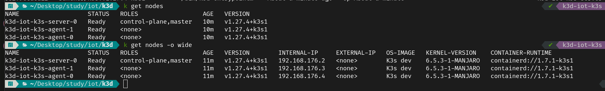
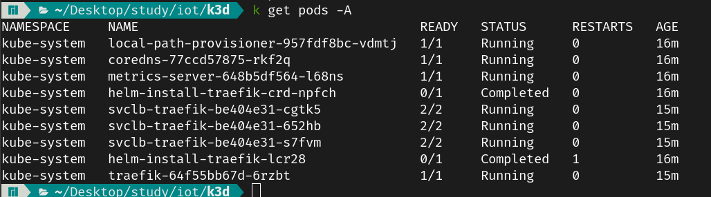
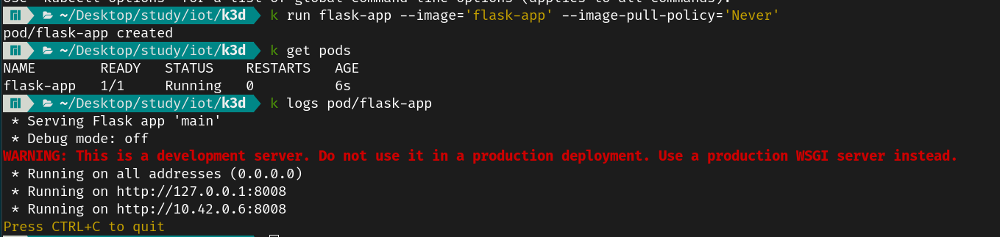

# IoT Lab: K3s Lab

This lab is designed to be used with the [K3s](https://k3s.io/) distribution of Kubernetes. K3s is a lightweight, CNCF-certified Kubernetes distribution that is optimized for IoT and edge computing. It is a fully compliant Kubernetes distribution with the following enhancements:

## Note
For the simplicity of this lab, we will be using [K3d]](https://k3d.io/) instead of K3s. K3d is a lightweight wrapper to run K3s (Rancher Lab's minimal Kubernetes distribution) in docker. It makes it very easy to create single- and multi-node k3s clusters in docker, e.g. for local development on Kubernetes-aware applications.


## Presented by:
- Mohamed Sofiene Barka
- Adam Lahbib
- Nour Elhouda Mami

## Github Repository
- [https://github.com/Nie-Mand/iot-k3s](https://github.com/Nie-Mand/iot-k3s)


# Setup 2 raspberry pi's VMs
- We have used a custom docker image to run the raspberry pi nodes each in a docker container. In the end of the process and while installing k3s, we have encountered some issues with the system modules like br_netfilter and overlay... We have switched to `k3d` to run k3s in docker containers in a much easier way. The custom image is in [this folder](https://github.com/Nie-Mand/iot-k3s/tree/main/k3s-attempt). 
- `getconf LONG_BIT` will return the architecture of the system. In our case, it is 32 bits.


# Install k3s

### Install k3s
```bash
curl -sfL https://get.k3s.io | sh -
```

### Verify installation
```bash
sudo kubectl get node
```
This command will return the node name and its status. When we add `-o wide` to the command, we will get more information about the node.

### Restart k3s
```bash
# k3s is installed as a linux service
sudo systemctl restart k3s
```

### Multiple Nodes

```bash
# on the server node
k3s token generate

# on the agent nodes
curl -sfL https://get.k3s.io | K3S_URL=https://server:6443 K3S_TOKEN=GENERATED_TOKEN sh -

# on the server node
sudo kubectl get node
```

### Kubeconfig
```bash
# on the server node
sudo cat /etc/rancher/k3s/k3s.yaml
```

### k3d

To setup a k3d cluster, we need to install k3d first. Then we can create a cluster with the following command:
```bash
k3d cluster create k3d-cluster --servers 1 --agents 2

# or simply create a config file and run
k3d cluster create -c k3d.yml
```




The Command `kubectl get pods -A` will return all the pods in all namespaces. The following command will return the pods in the `kube-system` namespace, which consists of traefik, core-dns, local-path-provisioner, metrics-server, and svclb-traefik.




### Helm
- Helm is a package manager for Kubernetes. It is used to deploy applications and services without the need to go through the process of creating the yaml files, As long as the request package exists of course.
- Helm is installed by default in k3s. We can check it by running `helm list -n kube-system`. The output will be empty if there are no helm charts installed in the `kube-system` namespace.
- Based on the output of the `k3d` command, we can see that traefik is installed in the `kube-system` namespace with helm.
- The reason of deploying Traefik in the `kube-system` namespace is that it is a reverse proxy that will be used to route the requests to the services in the cluster. It is a core component of the cluster, so it is deployed in the `kube-system` namespace.


# Docker
- Docker is a containerization platform that allows us to run applications in isolated environments called containers. It is used to package the application with all its dependencies and run it in any environment.
- Docker is installed by default in k3s. We can check it by running `docker ps`. The output will be empty if there are no containers running.
- Running `sudo docker run hello-world` will pull the hello-world image from docker hub and run it in a container.
- As an example, we have created a docker image that runs a python flask application. The response of the application is just "Hello World".
- The image is built with the command `sudo docker build -t flask-app .`. The `-t` flag is used to tag the image with the name `flask-app`. We can test the image by running `sudo docker run -p 8008:8008 flask-app`. The `-p` flag is used to map the port 8008 of the container to the port 8008 of the host machine.

# Kubernetes Shenanigans
- First of all, we should load the image to the k3d cluster. We can do that by running `sudo k3d image import flask-app:latest -c iot-k3s`. The `-c` flag is used to specify the cluster name.
- We can deploy the flask-app with the command `sudo kubectl run flask-app --image='flask-app' --image-pull-policy='Never'`
- This command will create a deployment with the name `flask-app` and the image `flask-app:latest`.



- We can do it the YAML way by creating a YAML file with [this content](https://github.com/Nie-Mand/iot-k3s/tree/main/manifest.yml)